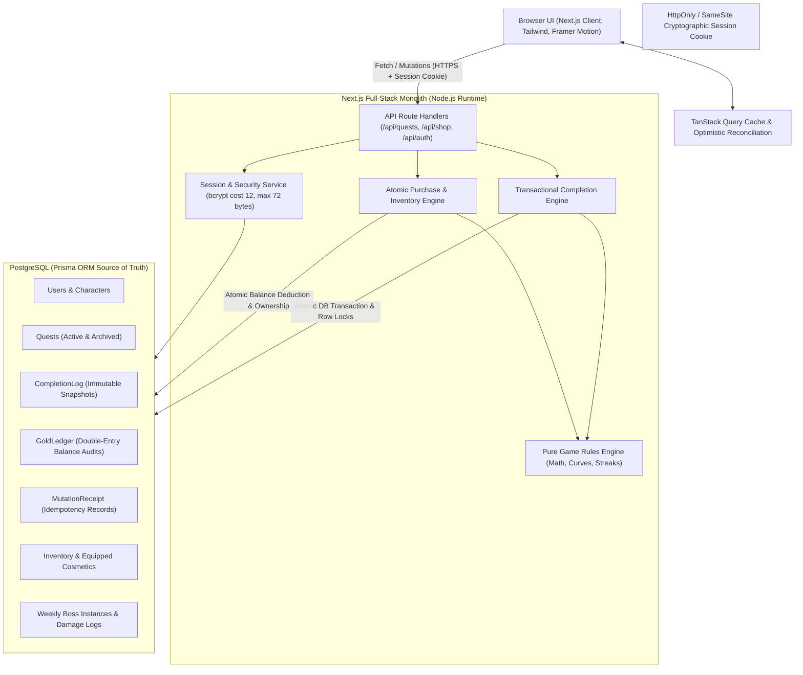
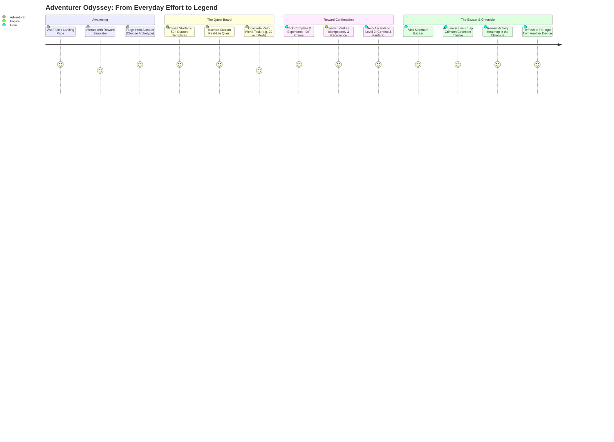
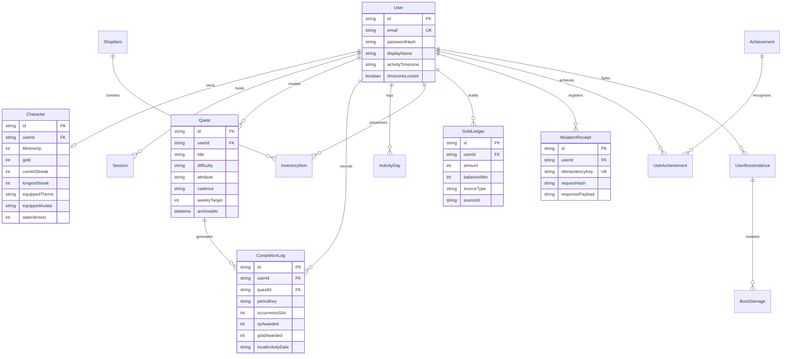
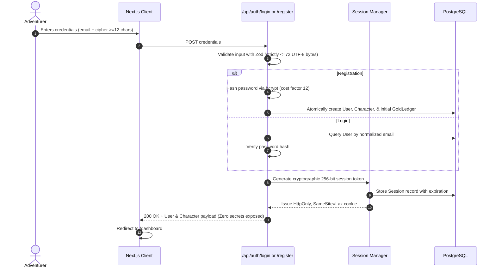
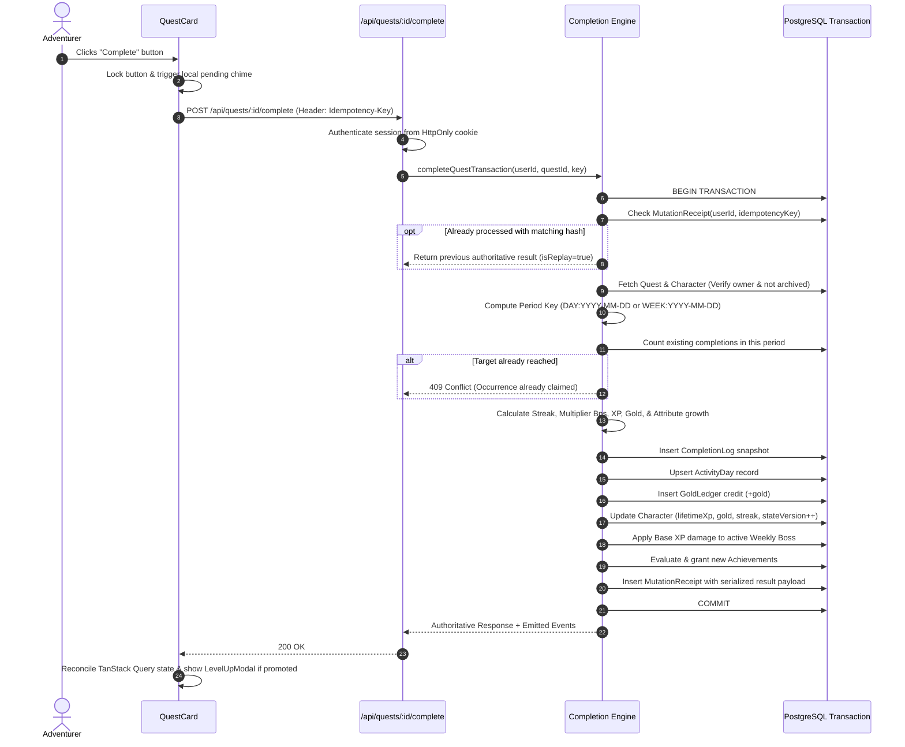
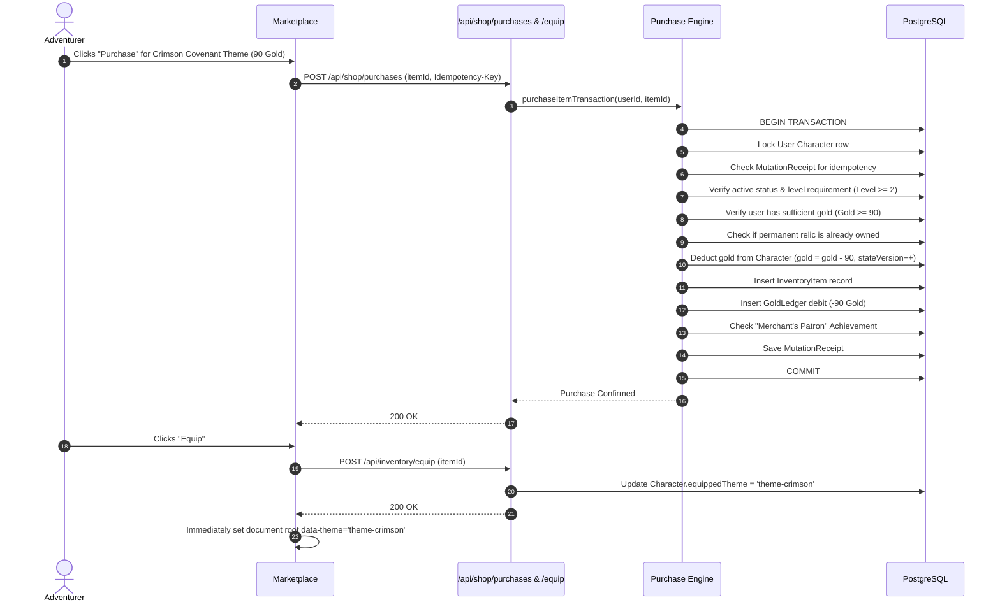
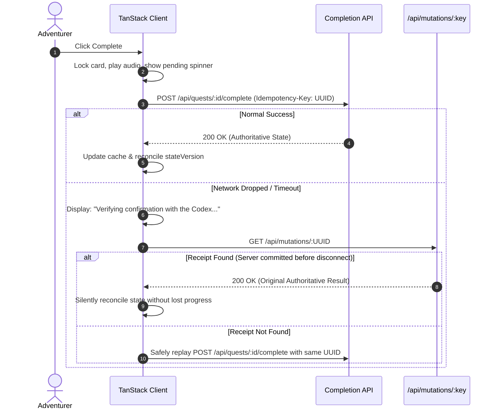
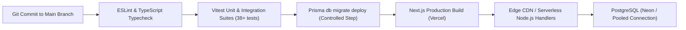

# Architecture & System Design: Arcane Codex — Life RPG

This document outlines the end-to-end technical architecture, data model, transactional workflows, and state-reconciliation mechanisms implemented in Arcane Codex.

---

## 1. System Architecture



---

## 2. User Journey



---

## 3. Database Entity Relationship (ER) Diagram



---

## 4. Signup & Login Authentication Flow



---

## 5. Transactional Quest Completion Engine



---

## 6. Streak & Multiplier Calculation

```mermaid
flowchart TD
    Start([Quest Completion Event]) --> CheckPrior{Prior activity date exists?}
    CheckPrior -- No --> FirstDay[Streak = 1\nLongest = 1]
    CheckPrior -- Yes --> CompareDate{Compare lastActivityDate to todayLocalDate}
    
    CompareDate -- Same Date --> SameDay[Streak unchanged\nMaintain current momentum]
    CompareDate -- Strictly Yesterday --> Consecutive[Streak = Streak + 1\nLongest = max(longest, new)]
    CompareDate -- Older than Yesterday --> Reset[Streak = 1\nLongest preserved without penalty]

    FirstDay --> CalcBonus
    SameDay --> CalcBonus
    Consecutive --> CalcBonus
    Reset --> CalcBonus

    CalcBonus["bonusSteps = min(max(streak - 1, 0), 25)\nmultiplierBps = 10000 + 200 * bonusSteps\n(1.00x to 1.50x bonus)"]
    CalcBonus --> Reward["xpAwarded = floor(baseXp * multiplierBps / 10000)\ngoldAwarded = floor(xpAwarded * 60 / 100)"]
```

---

## 7. Purchase & Cosmetic Equipment Transaction



---

## 8. Optimistic UI & Uncertain-Response Recovery



---

## 9. Deployment Pipeline


